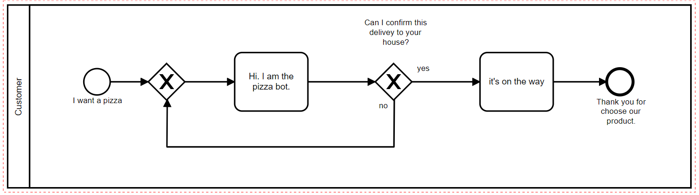

## BPMN to AIML. Draw a dialogue flow using BPMN for use in AIML chatbots.

Chatbot (or [chatterbot](http://www.simonlaven.com/)) is a computer program where a human being talks to the program using natural language. 
There are several technologies associated with the construction of chatterbots, one that stands out is [AIML](http://www.aiml.foundation/). AIML is a XML based language.
Designing flows in AIML is laborious and sometimes not intuitive due to the intrinsic characteristics of XML and AIML.
But building dialog flows using a visual language is much more intuitive.
There is a language used for mapping business processes called [BPMN](http://www.bpmn.org/) that defines visual components.
It is possible to convert BPMN notation to AIML and take advantage of all the visual features offered by this visual notation.
To validate this hypothesis a python application was developed that converts a BPMN diagram to a AIML file.
A case study was implemented where all the dialogues of a chatbot that talks about depression were mapped in BPMN and then converted in AIML, the AIML file was loaded into a AIML chatbot and was ready to be used.
One result found was a faster speed to draw the dialog flows of a chatbot in BPMN than to write in AIML.
Another result was to allow people who don't know AIML to write the dialogue flows for their chatbots.
Indirectly it is expected to spread the use of chatbots that are AIML based to an increasing number of people.

## Usage

- Make a BPMN diagram following the restrictions and premises below. 
For this purpose you can use [http://bpmn.io](https://www.bizagi.com/pt) or [Bizagi Modeler](https://www.bizagi.com/pt). This project don't have a BPMN Modeler bundled.
Download the BPMN file in a folder in your computer.

- See some [Examples](https://github.com/giseldo/chatdepressao/tree/master/exemplos) if necessary.

- Load the BPMN file downloaded and convert it into a AIML File.  
For this purpose this project come with a brand new BPMN to AIML converter and a AIML 2.0 chatbot (both are in the same project). 
There is a button in this chatbot that load the BPMN diagram in memory, convert it into a AIML file, and load the AIML file in the chatbot Knowledge base. 
This chatbot is based in a old code base of the excelent chatbot framework [program-y](https://github.com/keiffster/program-y). 

- You can acess the [Wiki](https://github.com/giseldo/chatbot_ari_bpmn_to_aiml/wiki) of this project for more information.

## Restriction and premisse

The BPMN Elements that can be used are: Start Event, End Event, Task and Gateway.

Start_Event and Gateway are elements that wait for the user do a input. Task and End_event are the output of the bot.

Also you can save the response of the user for later. For this use a comment in the gateway with the character $ in the start of the variable name. example: $varname). 
Later you can use the $varname in task example: "you selected $varname" (don't use wildcards in the variable name).

## Installation

$ git clone https://github.com/giseldo/chatbot_ari_bpmn_to_aiml.git 

$ pip install -r requirements

$ python.exe client_web.py  (pycharm recomended, use virtualenv also)

## contact

If you are in doubt, want to participate in the project, found a bug or even found the idea interesting contact me or open an issue, this will help the project a lot.
 
e-mail: giseldo@gmail.com

skype: giseldo

USER: I WANT A PIZZA

BOT: HI I AM THE PIZZA BOT

BOT: CAN I CONFIRM THIS DELIVERY TO YOUR HOUSE?

USER: YES

BOT: IT IS ON THE WAY

BOT: THANK YOU FOR CHOOSE OUR PRODUCT

 

 

