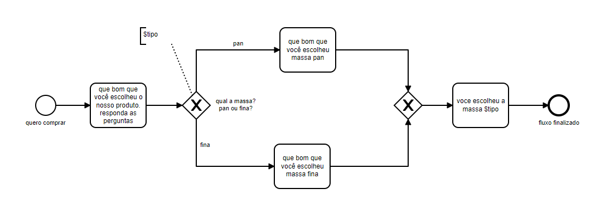

# Diagrama com variável

## Exemplo de diálogo após carregar o diagrama no chatbot

user: quero comprar
bot: que bom que você escolheu o nosso produto. responda as perguntas
bot: qual a massa? pan ou fina?
user: pan
bot: que bom que você escolheu massa pan
bot: você escolheu a massa pan
bot: fim do fluxo
